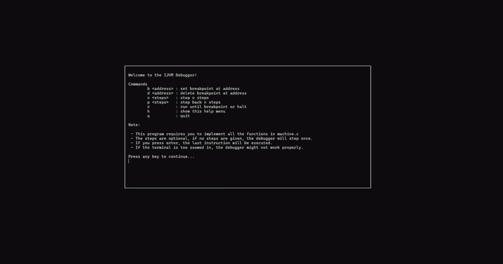
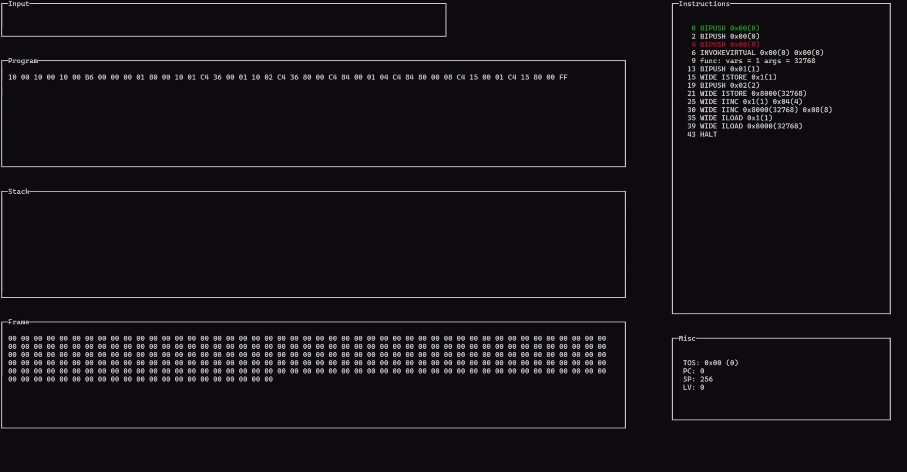

## Ncurses IJVM debugger

A terminal based debugger for the IJVM virtual machine. It allows you to step through the code, set breakpoints, and inspect the stack.

## Project Status

Finished, but might add more features in the future. 
Demo showcase: https://www.youtube.com/watch?v=0gH6FO1kZP4

## Project Screen Shot(s)

## Installation and Setup Instructions

Clone down this repository 

 `git clone https://github.com/AnassTaher/ncurses-ijvm-debugger/`

run `sudo apt-get install libc6-dev clang make valgrind git`  

Make IJVM binary:

`make ijvm` 

Make TUI binary:

`make tui`

Run:  

`./ijvm <path to .ijvm file>`  

or

`./tui <path to .ijvm file>`

## Reflection

  - Learning how to make textual interface using ncurses.
  - Adapting makefile to existing repository.
  - Linking C with C++ code (remember to use #extern "C" { ... } when including C headers in C++ code). This is due to C++ mangling function names.
